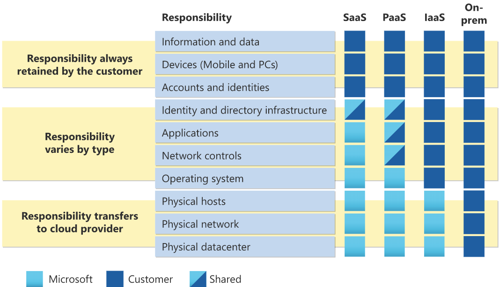

## What is cloud computing
Cloud computing is the delivery of computing services over the internet.

## The shared responsibility model
- Responsibility of the CSP
  - physical security
  - power
  - cooling
  - network connectivity
- Responsibility of the consumer
  - data and information stored in the cloud
  - access security
- Responsibility that depends

## Cloud models
- private
- public
- hybrid
- multi-cloud

### Azure Arc
Azure Arc can help manage your cloud environment, whether it's a public cloud solely on Azure, a private cloud in your datacenter, a hybrid configuration, or even a multi-cloud environment running on multiple cloud providers at once.

### Azure VMware Solution
Azure VMware Solution lets you run your VMware workloads in Azure with seamless integration and scalability.

## consumption-based model
- Capital expenditure (CapEx): one-time, up-front expenditure to purchase or secure tangible resources
- Operational expenditure (OpEx): spending money on services or products over time (The cloud model)

## availability and scalability
- availability: uptime 
  - Service availability is part of the service-level agreements (SLAs):
    - 99%
    - 99.9%
    - 99.95%
    - 99.99% in some services
- scalability: the ability to handle demand
  - Vertical scaling: increasing or decreasing the capabilities of resources
  - Horizontal scaling: adding or subtracting the number of resources

