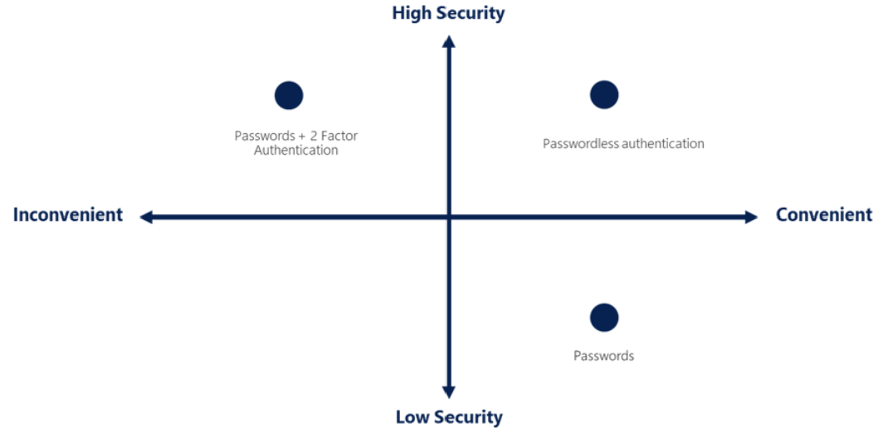

## Azure Active Directory
### What does Azure AD do?
- Authentication
- Single sign-on
- Application management
- Device management

### Azure AD Connect
Connect Azure AD with your on-premises AD

### Azure Active Directory Domain Services (Azure AD DS)
Provides managed domain services such as domain join, group policy, lightweight directory access protocol (LDAP), and Kerberos/NTLM authentication

## Azure authentication methods
- standard passwords
- single sign-on
- multifactor authentication
- passwordless

