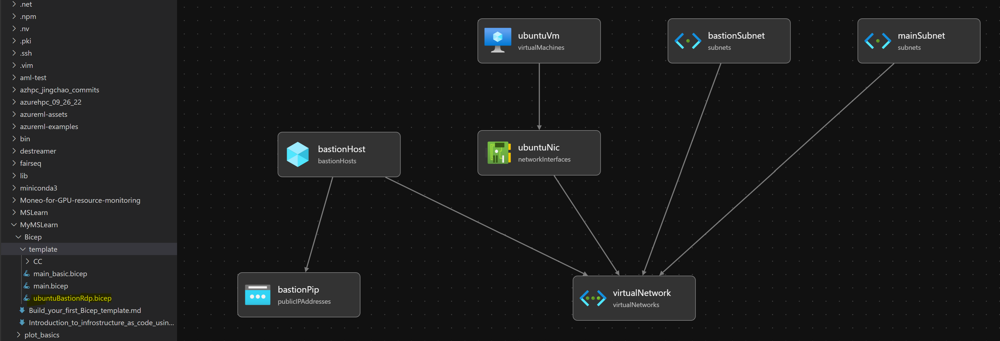
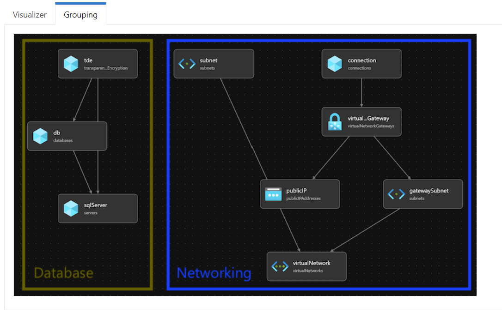

## Create and use Bicep modules

### Split an existing Bicep template into modules
The Bicep visualizer can help you put your whole Bicep file in perspective. The visualizer is included in the Bicep extension for Visual Studio Code.

To view the visualizer, open Visual Studio Code Explorer, select and hold (or right-click) the Bicep file, then select *Open Visualizer*. The visualizer shows a graphical representation of the resources in your Bicep file. It includes lines between resources to show the dependencies that Bicep detects.




> Note: You can also use a JSON ARM template as a module.

## Add parameters and outputs to modules
### Module parameters
- It's often better to leave the default value on the parent template and remove it from the module.
- Consider defining the business rules in your parent template, then explicitly pass module configuration through parameters.
Adding a description
```bash
@description('The name of the storage account to deploy.')
param storageAccountName string
```

### Conditions using `if`
```bash
param logAnalyticsWorkspaceId string = ''

resource cosmosDBAccount 'Microsoft.DocumentDB/databaseAccounts@2020-04-01' = {
  // ...
}

resource cosmosDBAccountDiagnostics 'Microsoft.Insights/diagnosticSettings@2021-05-01-preview' =  if (logAnalyticsWorkspaceId != '') {
  scope: cosmosDBAccount
  name: 'route-logs-to-log-analytics'
  properties: {
    workspaceId: logAnalyticsWorkspaceId
    logs: [
      {
        category: 'DataPlaneRequests'
        enabled: true
      }
    ]
  }
}
```

### Chain modules together
```bash
@description('Username for the virtual machine.')
param adminUsername string

@description('Password for the virtual machine.')
@minLength(12)
@secure()
param adminPassword string

module virtualNetwork 'modules/vnet.bicep' = {
  name: 'virtual-network'
}

module virtualMachine 'modules/vm.bicep' = {
  name: 'virtual-machine'
  params: {
    adminUsername: adminUsername
    adminPassword: adminPassword
    subnetResourceId: virtualNetwork.outputs.subnetResourceId
  }
}
```

### Example
main.bicep
```bash
@description('The Azure region into which the resources should be deployed.')
param location string = 'westus3'

@description('The name of the App Service app.')
param appServiceAppName string = 'toy-${uniqueString(resourceGroup().id)}'

@description('The name of the App Service plan SKU.')
param appServicePlanSkuName string = 'F1'

var appServicePlanName = 'toy-product-launch-plan'

module app 'modules/app.bicep' = {
  name: 'toy-launch-app'
  params: {
    appServiceAppName: appServiceAppName
    appServicePlanName: appServicePlanName
    appServicePlanSkuName: appServicePlanSkuName
    location: location
  }
}

@description('The host name to use to access the website.')
output websiteHostName string = app.outputs.appServiceAppHostName

@description('Indicates whether a CDN should be deployed.')
param deployCdn bool = true

module cdn 'modules/cdn.bicep' = if (deployCdn) {
  name: 'toy-launch-cdn'
  params: {
    httpsOnly: true
    originHostName: app.outputs.appServiceAppHostName
  }
}

output websiteHostName string = deployCdn ? cdn.outputs.endpointHostName : app.outputs.appServiceAppHostName
```
app.bicep
```bash
@description('The Azure region into which the resources should be deployed.')
param location string

@description('The name of the App Service app.')
param appServiceAppName string

@description('The name of the App Service plan.')
param appServicePlanName string

@description('The name of the App Service plan SKU.')
param appServicePlanSkuName string

resource appServicePlan 'Microsoft.Web/serverfarms@2021-01-15' = {
  name: appServicePlanName
  location: location
  sku: {
    name: appServicePlanSkuName
  }
}

resource appServiceApp 'Microsoft.Web/sites@2021-01-15' = {
  name: appServiceAppName
  location: location
  properties: {
    serverFarmId: appServicePlan.id
    httpsOnly: true
  }
}

@description('The default host name of the App Service app.')
output appServiceAppHostName string = appServiceApp.properties.defaultHostName
```
cdn.bicep
```bash
@description('The host name (address) of the origin server.')
param originHostName string

@description('The name of the CDN profile.')
param profileName string = 'cdn-${uniqueString(resourceGroup().id)}'

@description('The name of the CDN endpoint')
param endpointName string = 'endpoint-${uniqueString(resourceGroup().id)}'

@description('Indicates whether the CDN endpoint requires HTTPS connections.')
param httpsOnly bool

var originName = 'my-origin'

resource cdnProfile 'Microsoft.Cdn/profiles@2020-09-01' = {
  name: profileName
  location: 'global'
  sku: {
    name: 'Standard_Microsoft'
  }
}

resource endpoint 'Microsoft.Cdn/profiles/endpoints@2020-09-01' = {
  parent: cdnProfile
  name: endpointName
  location: 'global'
  properties: {
    originHostHeader: originHostName
    isHttpAllowed: !httpsOnly
    isHttpsAllowed: true
    queryStringCachingBehavior: 'IgnoreQueryString'
    contentTypesToCompress: [
      'text/plain'
      'text/html'
      'text/css'
      'application/x-javascript'
      'text/javascript'
    ]
    isCompressionEnabled: true
    origins: [
      {
        name: originName
        properties: {
          hostName: originHostName
        }
      }
    ]
  }
}

@description('The host name of the CDN endpoint.')
output endpointHostName string = endpoint.properties.hostName
```
Deploy command
```bash
az deployment group create --template-file main.bicep
```
