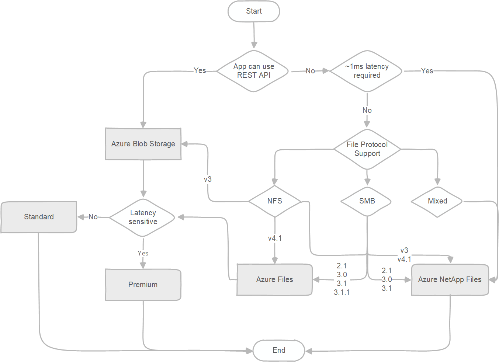

[Self Study Guide](https://learn.microsoft.com/en-us/certifications/azure-data-engineer/)

[Azure - Review your storage options](https://learn.microsoft.com/en-us/azure/cloud-adoption-framework/ready/considerations/storage-options)

[Azure Storage documentation](https://learn.microsoft.com/en-us/azure/storage/)

[Choose an Azure solution for data transfer](https://learn.microsoft.com/en-us/azure/storage/common/storage-choose-data-transfer-solution)

- Azure Files
  - [Azure Files and Azure NetApp Files comparison](https://learn.microsoft.com/en-us/azure/storage/files/storage-files-netapp-comparison)
  - Server Message Block (SMB) protocol 2.1, 3.0, 3.1.1, NFSv4.1
  - When to use
    - You want to "lift and shift" an application to the cloud that already uses the native file system APIs to share data between it and other applications running in Azure.
    - You want to replace or supplement on-premises file servers or NAS devices.
    - You want to store development and debugging tools that need to be accessed from many virtual machines.
- Azure Blobs
  - connect to Blob Storage using SSH File Transfer Protocol (SFTP), mount Blob Storage container using Network File System (NFS) 3.0 protocol
  - Allows unstructured data to be stored and accessed at a massive scale in block blobs.
  - Also supports Azure Data Lake Storage Gen2 for enterprise big data analytics solutions.
  - When to use
    - You want your application to support streaming and random access scenarios.
    - You want to be able to access application data from anywhere.
    - You want to build an enterprise data lake on Azure and perform big data analytics.
- Azure Disks
  - Allows data to be persistently stored and accessed from an attached virtual hard disk.
  - When to use
    - You want to "lift and shift" an applications that use native file system APIs to read and write data to persistent disks.
    - You want to store data that is not required to be accessed from outside the virtual machine to which the disk is attached.
- Azure NetApp Files
  - Offers a fully managed, highly available, enterprise-grade NAS service that can handle the most demanding, high-performance, low-latency workloads requiring advanced data management capabilities.
  - When to use
    - You have a difficult-to-migrate workload such as POSIX-compliant Linux and Windows applications, SAP HANA, databases, high-performance compute (HPC) infrastructure and apps, and enterprise web applications.
    - You require support for multiple file-storage protocols in a single service, including NFSv3, NFSv4.1, and SMB3.1.x, enables a wide range of application lift-and-shift scenarios, with no need for code changes.
- Azure Tables
  - Azure Table Storage is now part of **Azure Cosmos DB**.
  - Allows you to store structured NoSQL data in the cloud, providing a key/attribute store with a schemaless design.
- Azure Queues
  - Allows for asynchronous message queueing between application components.

[Azure Storage migration overview](https://learn.microsoft.com/en-us/azure/storage/common/storage-migration-overview?toc=%2Fazure%2Fstorage%2Fblobs%2Ftoc.json)
