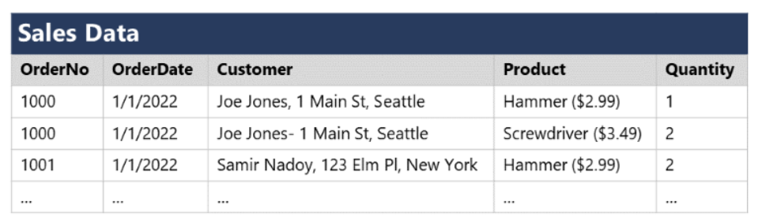
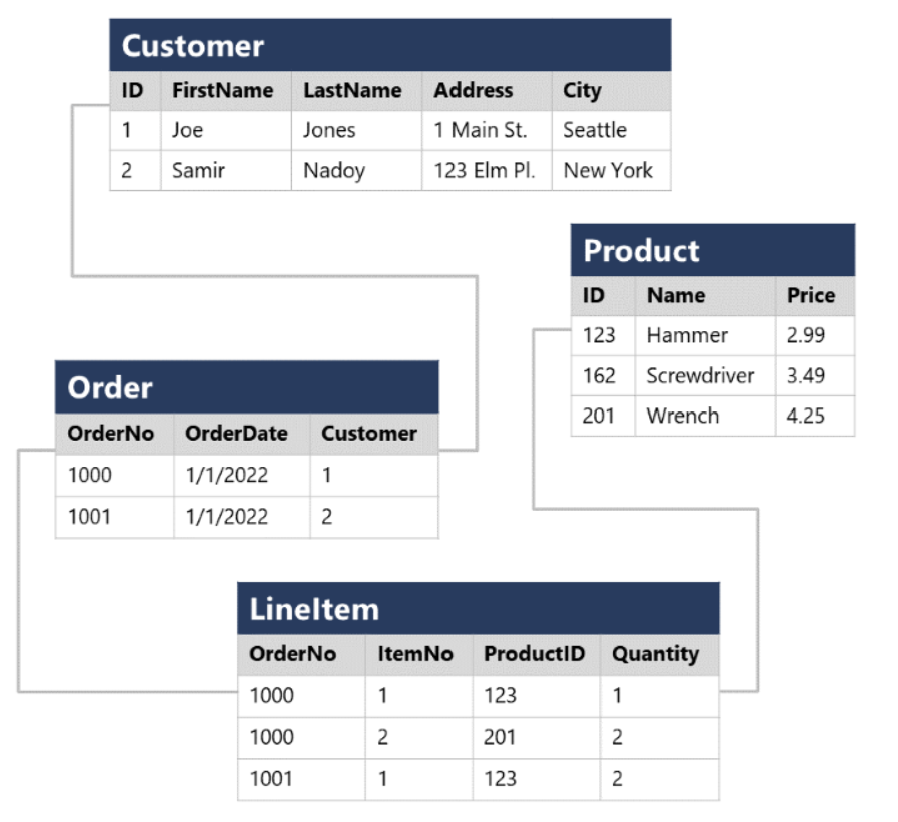

## Understand relational data
In a relational database, you model collections of entities from the real world as _tables_.
- each row in a table has the same columns
- not all columns need to have a value
- each column stores data of a specific datatype

## Understand normalization
Normalization is a term used by database professionals for a schema design process that minimizes data duplication and enforces data integrity.
- Separate each entity into its own table.
- Separate each discrete attribute into its own column.
- Uniquely identify each entity instance (row) using a primary key.
- Use foreign key columns to link related entities.

Without normalization


With normalization


Recording each instance of an entity as a row in an entity-specific table removes duplication of data. For example, to change a customer's address, you need only modify the value in a single row.

## Explore SQL
SQL stands for _Structured Query Language_, and is used to communicate with a relational database. You can use SQL statements such as **SELECT, INSERT, UPDATE, DELETE, CREATE**, and **DROP** to accomplish almost everything that you need to do with a database.

Dialects of SQL include:
- **Transact-SQL** (T-SQL). This version of SQL is used by Microsoft SQL Server and Azure SQL services.
- **pgSQL**. This is the dialect, with extensions implemented in PostgreSQL.
- **PL/SQL**. This is the dialect used by Oracle. PL/SQL stands for Procedural Language/SQL.

### SQL statement types
- Data Definition Language (DDL)
  - CREATE
  - ALTER
  - DROP
  - RENAME
- Data Control Language (DCL)
  - GRANT
  - DENY
  - REVOKE
- Data Manipulation Language (DML)
  - SELECT
  - INSERT
  - UPDATE
  - DELETE

DDL 
```sql
CREATE TABLE Product
(
    ID INT PRIMARY KEY,
    Name VARCHAR(20) NOT NULL,
    Price DECIMAL NULL
);
```

DCL
```sql
GRANT SELECT, INSERT, UPDATE
ON Product
TO user1;
```

DML
```sql
SELECT *
FROM Customer
WHERE City = 'Seattle';
```
```sql
SELECT FirstName, LastName, Address, City
FROM Customer
WHERE City = 'Seattle';
```
```sql
SELECT FirstName, LastName, Address, City
FROM Customer
WHERE City = 'Seattle'
ORDER BY LastName;
```
```sql
SELECT o.OrderNo, o.OrderDate, c.Address, c.City
FROM Order AS o
JOIN Customer AS c
ON o.Customer = c.ID
```
```sql
UPDATE Customer
SET Address = '123 High St.'
WHERE ID = 1;
```
```sql
DELETE FROM Product
WHERE ID = 162;
```
```sql
INSERT INTO Product(ID, Name, Price)
VALUES (99, 'Drill', 4.99);
```


## Describe database objects
In addition to tables, a relational database can contain other structures that help to optimize data organization, encapsulate programmatic actions, and improve the speed of access. In this unit, you'll learn about three of these structures in more detail: _views_, _stored procedures_, and _indexes_.
- Views
- Stored precedures
- indexes

Views

A view is a virtual table based on the results of a SELECT query. You can think of a view as a window on specified rows in one or more underlying tables.

```sql
CREATE VIEW Deliveries
AS
SELECT o.OrderNo, o.OrderDate,
       c.FirstName, c.LastName, c.Address, c.City
FROM Order AS o JOIN Customer AS c
ON o.Customer = c.ID;
```
```sql
SELECT OrderNo, OrderDate, LastName, Address
FROM Deliveries
WHERE City = 'Seattle';
```

Stored precedures

A stored procedure defines SQL statements that can be run on command. Stored procedures are used to encapsulate programmatic logic in a database for actions that applications need to perform when working with data.

```sql
CREATE PROCEDURE RenameProduct
	@ProductID INT,
	@NewName VARCHAR(20)
AS
UPDATE Product
SET Name = @NewName
WHERE ID = @ProductID;
```
```sql
EXEC RenameProduct 201, 'Spanner';
```

Index

An index helps you search for data in a table. Think of an index over a table like an index at the back of a book. Indexes improve query performance by locating rows with indexed column values.

```sql
CREATE INDEX idx_ProductName
ON Product(Name);
```


## Azure SQL services and capabilities
Azure SQL services include:
- SQL Server on Azure Virtual Machines (IaaS)
- Azure SQL Managed Instance (PaaS)
