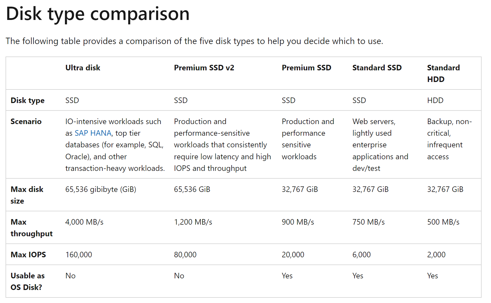
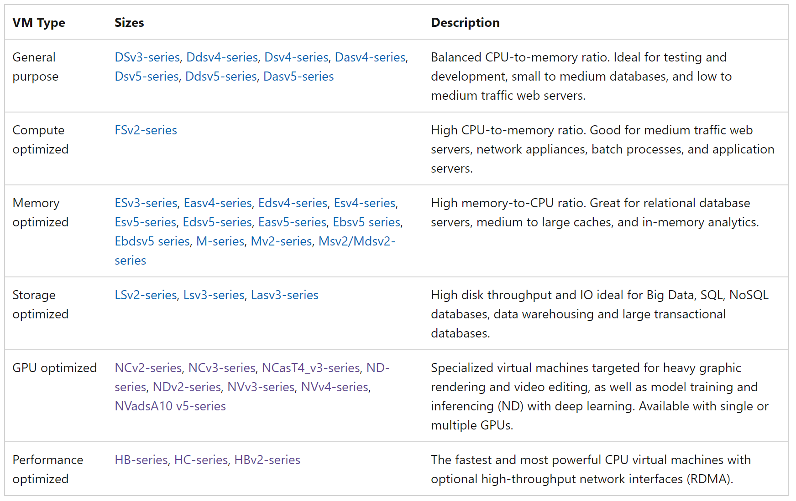
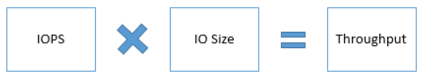
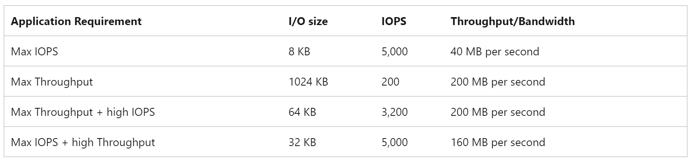

[Link to reference](https://learn.microsoft.com/en-us/azure/virtual-machines/premium-storage-performance#optimize-application-performance)

# [Disk Types](https://learn.microsoft.com/en-us/azure/virtual-machines/disks-types)

- Ultra disks
  - Ultra disks must be used as data disks and can only be created as empty disks. You should use Premium solid-state drives (SSDs) as operating system (OS) disks.
  - Azure ultra disks offer up to 32-TiB per region per subscription by default, but ultra disks support higher capacity by request.
  - Ultra disks come in several fixed sizes, ranging from 4 GiB up to 64 TiB.
  - Ultra disks support IOPS limits of 300 IOPS/GiB, up to a maximum of 160,000 IOPS per disk. To achieve the target IOPS for the disk, ensure that the selected disk IOPS are less than the VM IOPS limit.
  - The current maximum limit for IOPS for a single VM in generally available sizes is 80,000. Ultra disks with greater IOPS can be used as shared disks to support multiple VMs.
  - The throughput limit of a single ultra disk is 256-KiB/s for each provisioned IOPS, up to a maximum of 4000 MBps per disk (where MBps = 10^6 Bytes per second). The minimum guaranteed throughput per disk is 4KiB/s for each provisioned IOPS, with an overall baseline minimum of 1 MBps.

Ultra-disk Compatible

- Premium SSD v2
  - Azure Premium SSD v2 is designed for IO-intense enterprise workloads that require consistent sub-millisecond disk latencies and high IOPS and throughput at a low cost.
  - Unlike Premium SSDs, Premium SSD v2 doesn't have dedicated sizes.
  - Premium SSD v2 disks can't be used as an OS disk.
  - Premium SSD v2 capacities range from 1 GiB to 64 TiBs, in 1-GiB increments.
- Premium SSDs
  - Azure Premium SSDs deliver high-performance and low-latency disk support for virtual machines (VMs) with input/output (IO)-intensive workloads.
- Standard SSDs
  - Azure standard SSDs are optimized for workloads that need consistent performance at lower IOPS levels.
- Standard HDDs
  - Azure standard HDDs deliver reliable, low-cost disk support for VMs running latency-tolerant workloads.

# [Azure NetApp Files](https://learn.microsoft.com/en-us/azure/azure-netapp-files/azure-netapp-files-introduction)
The Azure NetApp Files service is an enterprise-class, high-performance, metered file storage service. Azure NetApp Files supports any workload type and is highly available by default. You can select service and performance levels, create NetApp accounts, capacity pools, volumes, and manage data protection.

# Application performance indicators
- IOPS
  - IOPS, or Input/output Operations Per Second, is the number of requests that your application is sending to the storage disks in one second. An input/output operation could be read or write, sequential, or random.
- Throughput
  - Throughput, or bandwidth is the amount of data that your application is sending to the storage disks in a specified interval. If your application is performing input/output operations with large IO unit sizes, it requires high throughput.
- Latency
  - Latency is the time it takes an application to receive a single request, send it to the storage disks and send the response to the client. This is a critical measure of an application's performance in addition to IOPS and Throughput.

- High IOPS matters most to OLTP applications processing millions of transactions in a second. 
- High Throughput is critical for Data Warehouse applications processing large amounts of data in a second. 
- Extremely low Latency is crucial for real-time applications like live video streaming websites.

Relation between throughput and IOPS

Here is an example on how you can calculate the IOPS and Throughput/Bandwidth for your application. 
- Consider an application using a P30 disk. The maximum IOPS and Throughput/Bandwidth a P30 disk can achieve is 5000 IOPS and 200 MB per second respectively. 
- If your application requires the maximum IOPS from the P30 disk and you use a smaller IO size like 8 KB, the resulting Bandwidth you will be able to get is 40 MB per second. 
- If your application requires the maximum Throughput/Bandwidth from P30 disk, and you use a larger IO size like 1024 KB, the resulting IOPS will be less, 200 IOPS. 

